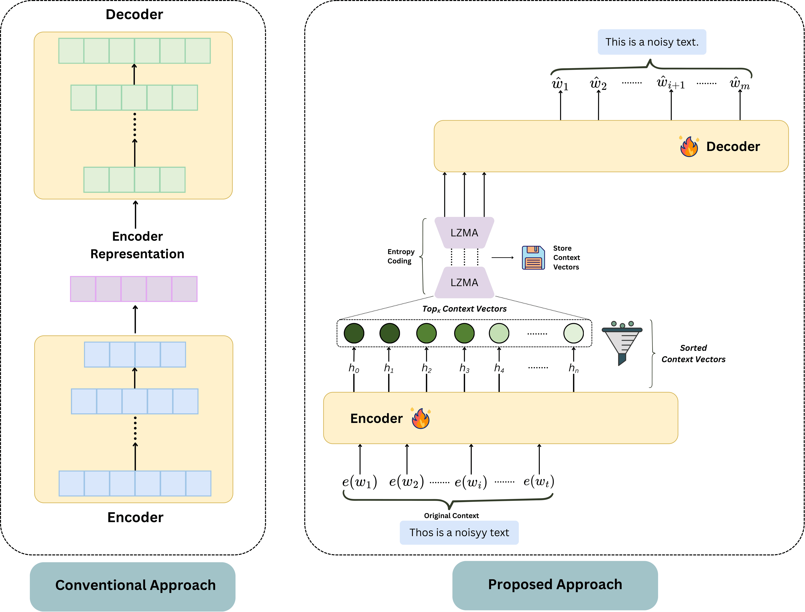

# TextEconomizer: Enhancing Lossy Text Compression with Denoising Transformers and Entropy Coding

## Published in Neural Networks (Elsevier) · IF: 6.3 · CiteScore: 10.9 🎉

[](https://www.sciencedirect.com/science/article/abs/pii/S089360802600571X)
[](https://www.sciencedirect.com/journal/neural-networks)
[](https://doi.org/10.1016/j.neunet.2026.109111)
[](LICENSE)

> 🗜️ **TL;DR**: TextEconomizer is a lightweight encoder-decoder framework that achieves up to **5.39× compression** with only **86M parameters** — approximately **153× fewer** than comparable models like ICAE — by selecting the most semantically informative context vectors (Kizuki vectors) and applying LZMA entropy coding, all while maintaining near-perfect text quality on BLEU, ROUGE, METEOR, and BERTScore.

---

**Abstract:** Lossy text compression reduces data size while preserving core meaning, making it well-suited for tasks like summarization, automated analysis, and digital archives where exact fidelity is less critical. Despite the dominance of transformer-based models in language modeling, the integration of context vectors and lossless entropy coding into Sequence-to-Sequence (Seq2Seq) text generation remains underexplored. A key challenge lies in identifying the most informative context vectors from the encoder output and incorporating entropy coding into the transformer framework to enhance storage efficiency while maintaining high-quality outputs, even in the presence of noisy text. Previous studies have primarily focused on near-lossless token generation, often overlooking space efficiency. In this paper, we introduce **TextEconomizer**, an encoder-decoder framework paired with a transformer neural network. This framework utilizes its latent representation to reduce variable-sized inputs by **50% to 80%**, without prior knowledge of dataset dimensions. Our model achieves competitive compression ratios by incorporating entropy coding, while delivering near-perfect text quality, as assessed by Bilingual Evaluation Understudy (BLEU), Recall-Oriented Understudy for Gisting Evaluation (ROUGE), Metric for Evaluation of Translation with Explicit ORdering (METEOR), and semantic similarity scores. Notably, **TextEconomizer** operates with approximately **153× fewer parameters** than comparable models, achieving a compression ratio of **5.39×** without sacrificing semantic quality. Additionally, we evaluate our framework by implementing a Long Short-Term Memory (LSTM)-based autoencoder, commonly used in image compression, and by integrating advanced modules within the transformer architecture as alternatives to conventional techniques. Our autoencoder achieves a state-of-the-art compression ratio of **67×** with **196× fewer parameters**, while our modified transformer, **LLaMAFormer**, achieves a **263-fold reduction** in parameters compared to ICAE while maintaining competitive text quality. The **TextEconomizer** framework significantly surpasses existing transformer-based models in balancing memory efficiency and high-fidelity outputs, marking a breakthrough in lossy compression with optimal space utilization.

---

## Overview

<p align="center">
  
</p>

**(Left)** Illustration of a conventional transformer encoder-decoder architecture where the latent representation retains the full dimensionality of the input sequence, often resulting in redundant calculations. **(Right)** Our proposed framework is designed for efficient text reconstruction. The model encodes noisy input text into a sequence of context vectors (h₀, ..., hₙ). A probabilistic sorting prioritizes these vectors based on information density, followed by a Top_k selection strategy to isolate the most salient Kizuki vectors. These vectors are then compressed using Entropy Coding (LZMA) for further memory efficiency before being decoded to generate the corrected output (ŵ). This pipeline effectively reduces memory overhead without sacrificing reconstruction quality, enabling more efficient downstream decoding and transmission.

---

## Key Contributions

- **Pragmatic Text Noise Process** — A sophisticated noise injection strategy covering synonym substitution, spelling corruption, auxiliary verb omission, typographical errors, and punctuation perturbation, enabling the framework to learn robust real-world denoising behavior.

- **Kizuki Selector** — A novel top-k probabilistic filtering mechanism over RMS-normalized context vectors with a dynamic temperature parameter, identifying the most semantically informative encoder outputs and eliminating redundant cross-attention computation.

- **TextEconomizer** — A vanilla-transformer-based autoencoder with 86M parameters achieving 5.39× compression and BLEU scores above 97 on PwC, outperforming ICAE (13.13B params) and NUGGET (602M params) in memory efficiency.

- **LLaMAFormer** — A lightweight transformer variant (50M params) incorporating RoPE, SwiGLU, and RMSNorm, achieving 263× fewer parameters than ICAE while maintaining competitive text quality, particularly robust in high-sparsity regimes.

- **LSTM Autoencoder** — A fixed-bottleneck autoencoder achieving state-of-the-art **67× compression** on PwC with 196× fewer parameters than transformer-based alternatives, suitable for extreme memory-constrained deployments.

- **Entropy Coding Integration** — Systematic evaluation of LZMA over Kizuki vectors, contributing 1.07× to 1.39× additional compression on top of token pruning, with detailed ablation isolating neural vs. coding contributions.

---

## Architecture

TextEconomizer follows a three-stage pipeline:

```
Noisy Input Text
      ↓
  Encoder (6-layer Transformer)
  [Positional Encoding + Multi-Head Self-Attention + FFN]
      ↓
  Kizuki Selector
  [Learnable MLP scoring → Softmax with dynamic temperature T → Top-k selection]
      ↓
  Entropy Coding (LZMA compression → storage → LZMA decompression)
      ↓
  Decoder (6-layer Transformer)
  [Masked Self-Attention + Cross-Attention over Kizuki vectors + FFN]
  [Teacher forcing during training; autoregressive at inference]
      ↓
  Reconstructed Clean Text
```

The **Kizuki Selector** is the architectural centrepiece: for each encoder output context vector, a lightweight MLP scores its saliency over RMS-normalized embeddings, and a temperature-scaled softmax prioritises semantically dense tokens. For short sequences a higher temperature T smooths the distribution; for long sequences T approaches zero, approximating an argmax. The top-k vectors (where k = ⌈r·n⌉, r being the reduction ratio) then serve as the sole Key and Value inputs to the decoder's cross-attention layer.

---

## Models at a Glance

| Model | #Params | Token% | Compression Ratio | BLEU (PwC) | BLEU (WMT19) | Decoding Speed |
|---|---|---|---|---|---|---|
| ICAE | 13.13B | 100% | 4× | 99.8 | — | — |
| NUGGET | 602M | 10% | 10× | — | 99.0 | 38 KB/s |
| T5-Small | 70M | 100% | Θ | 38.29 | 50.15 | — |
| **TextEconomizer** | **86M** | **50%** | **3.86×** | **96.98** | **93.18** | **121 KB/s** |
| **TextEconomizer** | **86M** | **20%** | **5.39×** | **95.61** | **90.97** | **146 KB/s** |
| **LLaMAFormer** | **50M** | **50%** | **3.86×** | **95.94** | **93.61** | **107 KB/s** |
| **AutoEncoder** | **67M** | **100%** | **67×** | **95.75** | **91.94** | **5 KB/s** |

Θ = no memory savings.

---

## Results Summary

### Effect of Kizuki Vector Reduction (Temperature Scaling, PwC Dataset)

| Model | Token% | BLEU | BERTScore | ROUGE-L | METEOR | PPL |
|---|---|---|---|---|---|---|
| TextEconomizer | 20% | 95.61 | 99.11 | 98.35 | 94.63 | 4.85 |
| TextEconomizer | 50% | 96.98 | 99.41 | 99.26 | 95.24 | 4.34 |
| TextEconomizer | 100% | 97.33 | 99.46 | 99.49 | 98.87 | 4.25 |
| LLaMAFormer | 20% | 92.67 | 98.56 | 96.50 | 91.43 | 4.89 |
| LLaMAFormer | 50% | 95.94 | 99.22 | 98.61 | 95.43 | 4.21 |

### Robustness to Test-Time Noise (WMT19, 100% retention)

TextEconomizer achieves BLEU 92.57 and BERTScore 98.58 under noisy inference — only a **1.56-point BLEU drop** and **<0.3-point BERTScore degradation** relative to the clean baseline, confirming strong real-world robustness.

### Compression Decomposition (PwC)

| Component | Contribution |
|---|---|
| Token pruning at 20% | 4× |
| LZMA entropy coding | +1.39× |
| **Total** | **5.39×** |
| AutoEncoder (neural) | 64.33× |
| LZMA over AutoEncoder | +2.67× |
| **Total** | **67×** |

---

## Repository Structure

```
TextEconomizer/
├── Assets/                    # Figures and visual assets
├── Datasets/
│   ├── WMT14/                 # WMT14 EN-FR parallel corpus (600K subset)
│   ├── WMT19/                 # WMT19 EN-ZH parallel corpus (600K subset)
│   ├── PwC/                   # Prompt-With-Context dataset (~242K instances)
│   └── BookCorpus/            # BookCorpus monolingual data (1M pairs)
├── Notebooks/                 # Training and evaluation notebooks
└── README.md
```

---

## Datasets

| Dataset | Train | Test | Avg. Length | Domain |
|---|---|---|---|---|
| PwC | ~242K | 18.1K | 35.52 words | Context-dependent QA |
| WMT14 EN-FR | 600K | 3K | 21.68 words | News / Europarl |
| WMT19 EN-ZH | 600K | 3.98K | 12.67 words | News |
| BookCorpus | 1M | 20K | 15.13 words | Fiction / Literature |

All datasets use synthetically noised source sentences (via the pragmatic noise injection process) paired with clean target sentences.

---

## Noise Injection Strategy

The data augmentation pipeline introduces controlled linguistic variability through:

- **Named Entity Recognition (NER)** — preserves entities from corruption
- **POS-guided corruption** — contextual synonym substitution (MLM, p=0.5), spelling augmentation (p=0.3), random word substitution (p=0.2)
- **Auxiliary verb omission** — probabilistic deletion of auxiliary verbs
- **Punctuation corruption** — random deletion or insertion (p=0.2 per word)
- **Corruption rate** — normally distributed: pc ~ N(μ=0.6, σ=0.1), capped at pmax=0.5

---

## Hyperparameters

| Parameter | Value |
|---|---|
| Hidden dimension | 512 |
| Feed-forward neurons | 2048 |
| Encoder/Decoder layers | 6 |
| Dropout | 0.1 |
| Activation | ReLU (TextEconomizer) / SwiGLU (LLaMAFormer) |
| Positional encoding | Absolute (TextEconomizer) / RoPE (LLaMAFormer) |
| Optimizer | AdamW |
| Learning rate | 5×10⁻⁵ |
| Epochs | 50 |
| Loss | Categorical cross-entropy |
| Hardware | NVIDIA Tesla P100 (16GB HBM2), 30GB RAM |

---

## Citation

If you use TextEconomizer in your research, please cite:

```bibtex
@article{SOBHANI2026109111,
  title   = {TextEconomizer: Enhancing lossy text compression with denoising transformers and entropy coding},
  journal = {Neural Networks},
  volume  = {203},
  pages   = {109111},
  year    = {2026},
  issn    = {0893-6080},
  doi     = {https://doi.org/10.1016/j.neunet.2026.109111},
  url     = {https://www.sciencedirect.com/science/article/pii/S089360802600571X},
  author  = {Mahbub E Sobhani and Anika Tasnim Rodela and Chowdhury Mofizur Rahman and Dewan Md. Farid and Swakkhar Shatabda},
  keywords = {TextEconomizer, Transformer, Text compression, Encoder, Decoder, Auto-encoder, Denoising transformer},
}
```

---

## Future Work

- Knowledge distillation from multilingual models to extend TextEconomizer beyond English
- Quantization for improved compression outcomes
- Text compression in low-resource languages such as Bangla
- Large-scale experiments integrating contrastive learning techniques

---

## Acknowledgements

This research was partly funded by the **ICT Division of the Government of the People's Republic of Bangladesh** for the 2024–25 financial year (tracking no: 26FS110481).

---

## Related Work from the Authors

- **MathMist** — A parallel multilingual benchmark for mathematical problem solving and reasoning across 13 languages (EACL 2026). [[Paper]](https://aclanthology.org/2026.findings-eacl.131/) [[arXiv]](https://arxiv.org/abs/2510.14305) [[Dataset]](https://huggingface.co/datasets/mahbubhimel/MathMist)
- **Multi-Agent Geometry Reasoning** — Evaluating agentic frameworks for diagram-grounded geometry problem solving across Geometry3K, MathVerse, OlympiadBench, and We-Math (EACL 2026). [[Paper]](https://aclanthology.org/2026.eacl-srw.4/)
- **CodeMist** — A transformer-based framework for Bangla instruction-to-code generation (BLP-2025). [[Paper]](https://aclanthology.org/2025.banglalp-1.67/)
- **Jatikarok** — A monolingual transformer-based method for Bangla punctuation restoration with a large-scale 1.48M-pair corpus (BLP-2023). [[Paper]](https://aclanthology.org/2023.banglalp-1.3/)
